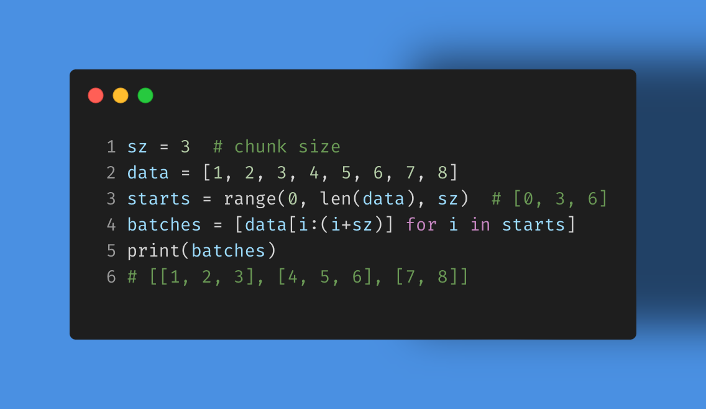

A common developer pattern is divide-and-conquer. This handy snippet is a good example in #python how you can break a data processing or #dataengineering problem into bite-sized chunks.

Suppose you have some data you want to break into a set size of chunks or batches. You can define your break points and then use a list comprehension to redefine your data as a set of batches to process. Next step is to then process each batch using some common pattern.

Can you refactor this to better handle memory (generators)? How would you iterate through your batches to process them? Would you use concurrent.futures to do parallel processing? How about async?

