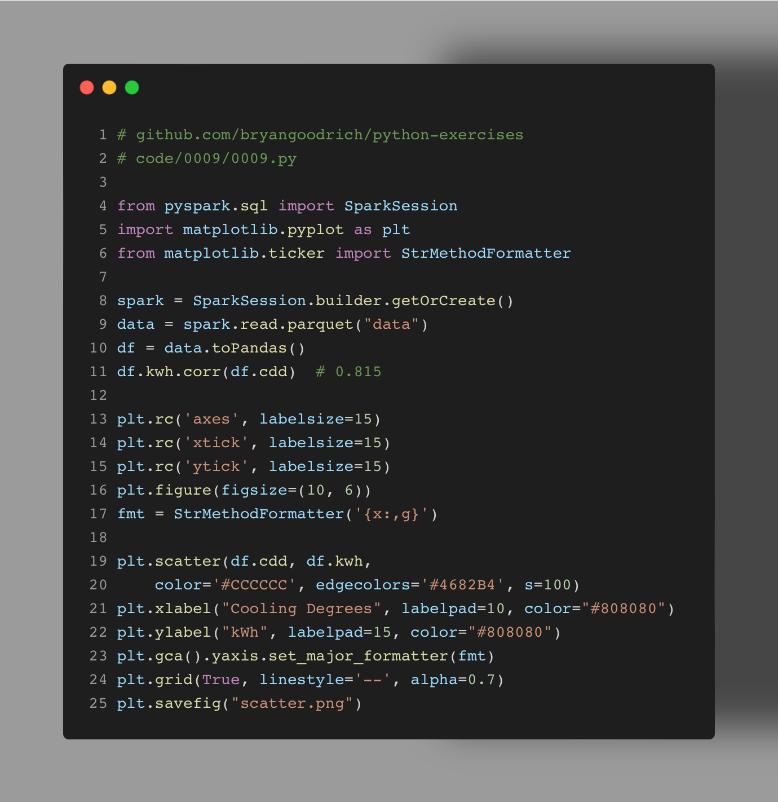
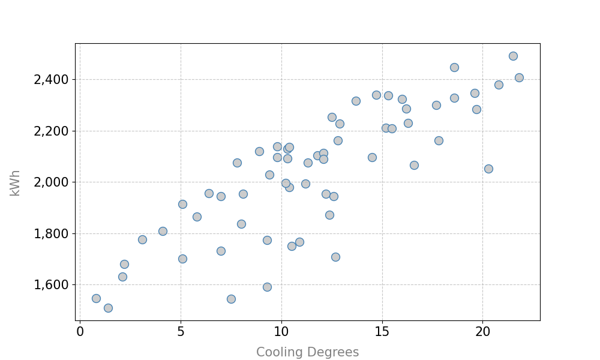

Data visualization is a key skill all analysts need to learn, whether using Tableau or #Python, the principles are the same. Here I hope to share a few I've learned through cartography--the art and science of map making--and using the visual hierarchy.

This example extends my previous. I saved the #spark dataframe into this folder. We read it back in with Spark, and we can immediately convert it to a Pandas dataframe. We compare the correlation between energy usage (kWh) and temperature (CDD). At over 80%, clearly this time series exhibits a high temperature sensitivity! So let's explore this visually. 

In the plot, we can see this upward trajectory. To avoid "chart junk", I keep the data points grey, but distinct with colored borders. I provide thin reference lines, and lightened axis labels. For easy reading, the viewer can easily draw their attention to the tick values, properly formatted. A good trick is like an impressionist painting. If you squint at it and slowly open your eyes, the order of things that pop out to you is the visual hierarchy you're projecting to your viewer. 

Do you use any custom libraries in visualizing? Do people still use ggplot in Python or is that stuck in the R world? Do you prefer going from data to visual app like Tableau or Power BI? 

## Output

