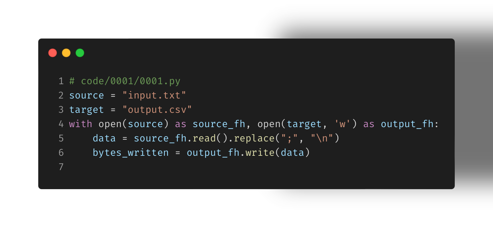

Something you may not know with #python is that you can combine multiple file context managers at once.

This simple example can help you automate converting one file into another. My input is a byte stream separated by semicolons and the output is broken into lines.

Converts
age,name,gender;21,auburn,f;32,bill,m;43,claire,f

Into
age,name,gender
21,auburn,f
32,bill,m
43,claire,f

What change would you make? How would you make this process use less memory if the byte stream was, say, 1 TB in size? How would you convert this into a command line utility for easy sharing and reuse?

