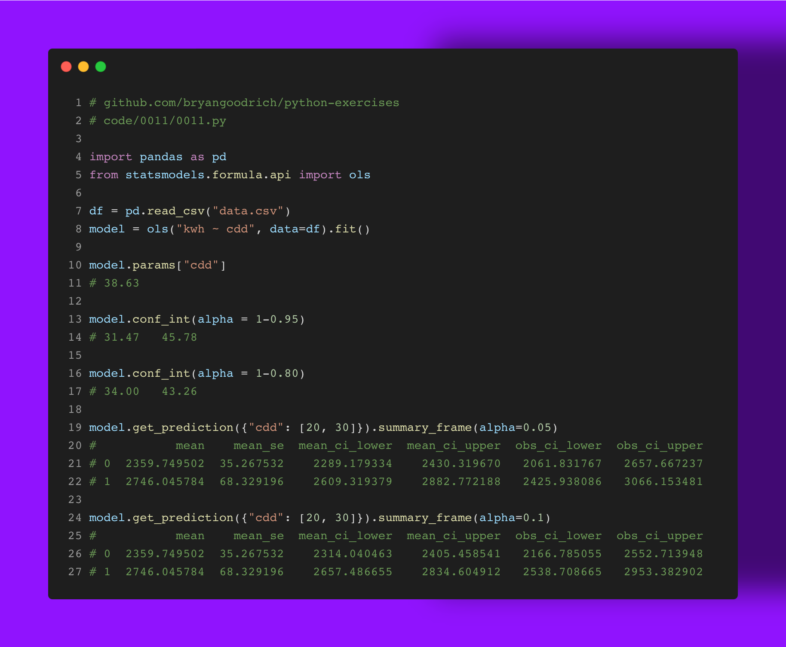

It always irks me when a contractor gives a presentation that management gobbles up without ever questioning the numbers provided. Specifically when there is a small sample size and point estimates are given. They always assume and use alpha=95% signficance levels, never consider others, and almost never provide confidence intervals.

Here I show you how with a little #python, we can easily capture our estimates, provide confidence intervals, and do a little better at communicating our statistical results. Using the dataset in my previous #Spark examples, I fit a model of energy usage to cooling degree days (temperature) which is highly correlated in this instance. We fit the model and see our cofficient that a 1 degree increase in temperature on average above 65F will increase consumption by nearly 39 kWh per day. But that point estimate is utterly meaningless by itself! Sure, the standard assumption suggests this estimate is between 32 to 46 kWh, but this estimate could be more tightly around 34 to 43 with a more lax alpha level. This also applies to prediction values as shown for when temperatures are 85F and 95F degrees on average. 

Are you also annoyed when presentations don't account for their small sample sizes and lack of confidence intervals? How do you decide your significance levels? What other ways do you improve your presentations when showing #statistics?

