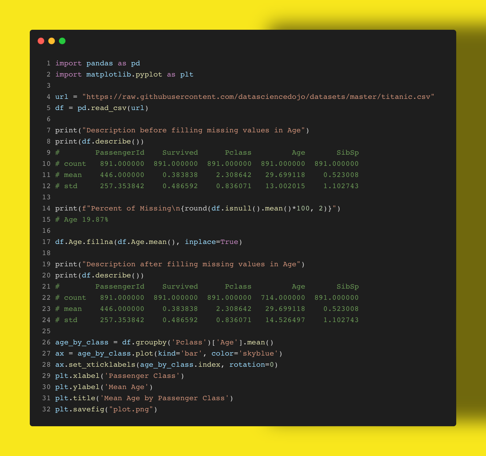

Handling missing values is critical to any #dataengineering and #datascience work you do in #Python. Here is a brief example of the classic Titanic dataset you can explore. 

Age has nearly 1 in 5 missing values. We can fill these with the average to get a more complete picture with just a few lines of code. 

Would you like to see more advanced methods for imputing or filling missing values? How would you handle the missing values in Cabin or Embarked?

