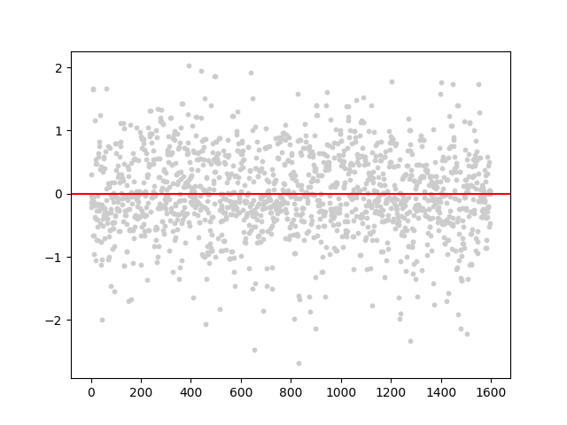
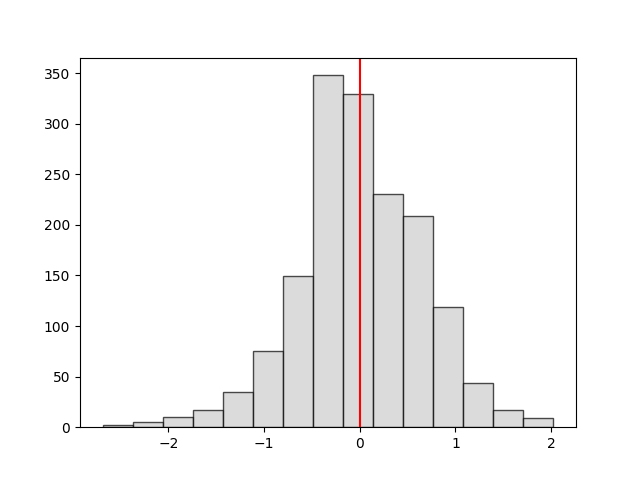
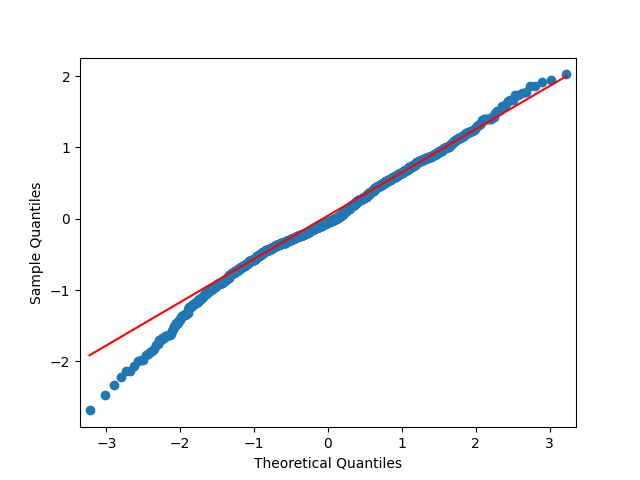

I'd argue residual analysis is one of the top 5 most important things in statistical modeling. Visual and inferential #statistics are a breeze with a few #python libraries. 

Using the Red Wine Quality dataset, we fit a lousy model that serves a great example of non-normal error distribution. Now we could talk for days about the impacts this has on your modeling efforts, but I'll save that for another day!

Do you fret over your data being normally distributed? What other tests do you run for residual analysis? What are your go-to remedial measures to fix troubling residuals and model specifications? 

# Outputs

## Scatter Plot

## Histogram

## QQ-Plot

