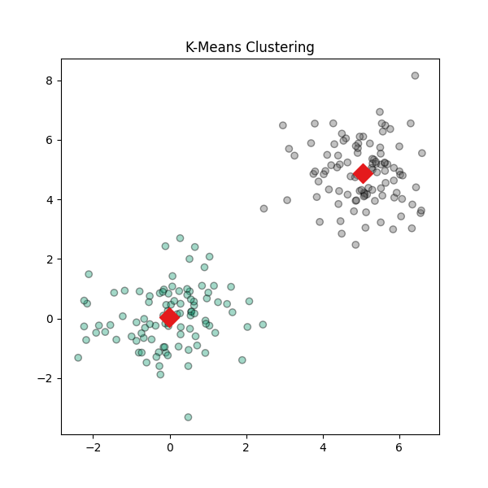
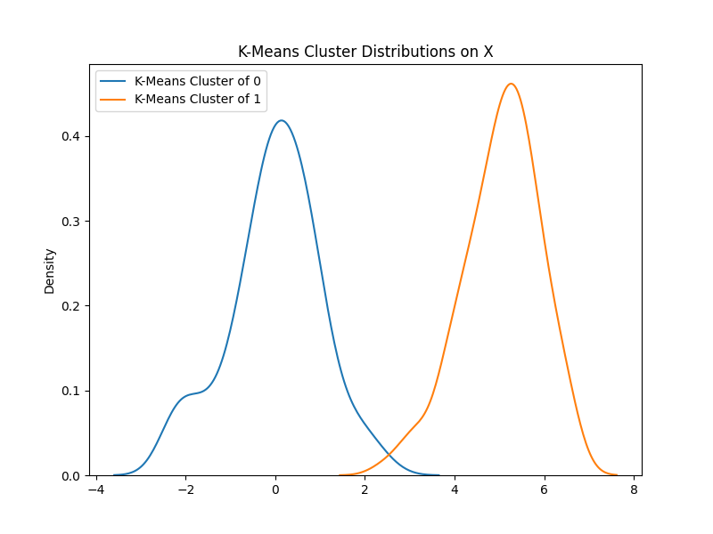

It's easy to run a canned algorithm from sklearn, but do you understand what it's doing and when to use it? 

I want to dig into K-Means more deeply than last week in this example by showing how it follows the Expectation-Maximization algorithm. Whereas EM fits each point to some probablity (soft assignment) in K using some distribution, K-Means does a hard assignment using the L2-Norm. The maxtrix algebra is directly out of Numpy, so this is an easy iterative 2-step process to code up by hand!

What challenges have you had using unsupervised learning? Do you want to see more about how to prepare data for K-Means and other algorithms? Let me know in the comments below! 

# Output

