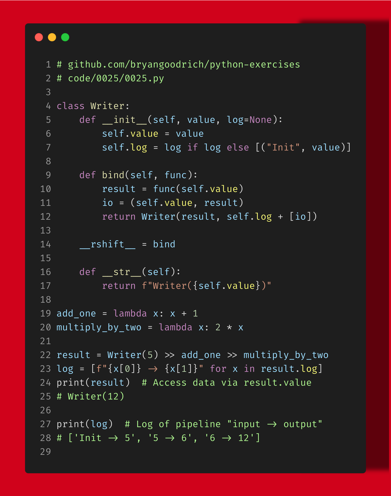

The Writer Monad is an excellent example to appreciate the utility of using functional programming. Here I use it to log the input/output of each function call in a pipeline of functions composed together and present the flow of data through the pipeline: a pattern every developer can use in their #dataengineering applications!

Do you want to see more functional programming concepts? How about other ways to handle logging? Or maybe a decorator approach to this problem? Let me know in the comments below!

------
🗣 If you like this post, follow me for daily #python tips, and hit that like button so the algorithms help other’s see it, too. For full code and data on this and earlier exercises, visit https://www.github.com/bryangoodrich/python-exercises
------

