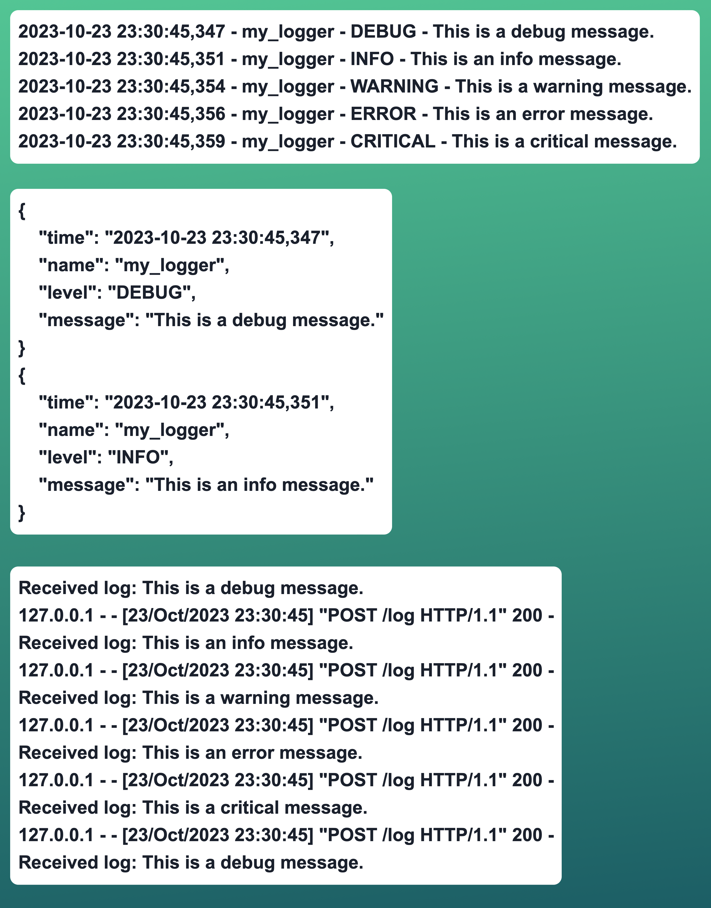

Let's review logging. It's not hard to get started at all! I'll show you 3 versions, including a REST endpoint.

The first 2 loggers are file loggers, but we control the formatting to write JSON. The third one we point to a REST endpoint /log to receive it. We also have code for this Flask app to handle printing to the standard output (console). I show all 3 outputs for comparison. Note, the JSON is not prettified in file.

What logging do you use? Do you want to see how to handle logging and metrics capture with other tools like LogStash or Prometheus? Let me know in the comments below!

------
🗣 If you like this post, follow me for daily #python tips, and hit that like button so the algorithms help other’s see it, too. For full code and data on this and earlier exercises, visit https://www.github.com/bryangoodrich/python-exercises
------

# Output

