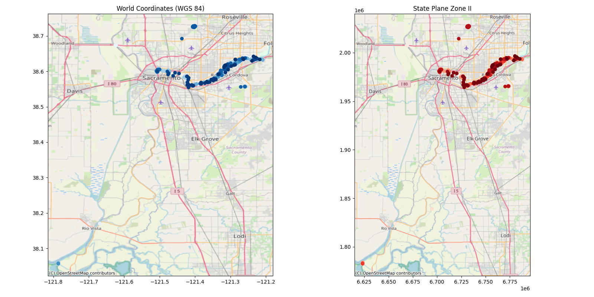

More Maps Please! 

As promised, here's an example of projections in geospatial data. 

We use geopandas to import a parks geojson from data.saccounty.gov, a local government with a strong GIS background. The data comes in with spatial coordinates (lat, lon), but we want to better represent the locality of these data by projecting to a 2D rectilinear scale defined by State Plane coordinates. Easy with Geopandas! Just change the coordinate reference using the EPSG number for this projection. 

With a little help, we use an OpenStreetMap base layer for context and plot both datasets. Definitely a difference, but really matters when you compare distances vs shapes. No projection preserves both. Kind of the problem with flattening a sphere!

#datanalytics #datascience #dataengineering #machinelearning #devops

------
🗣 If you like this post, follow me for daily #python tips, and hit that like button so the algorithms help others see it, too. For full code and data on this and earlier exercises, visit https://www.github.com/bryangoodrich/python-exercises
------

# Output

