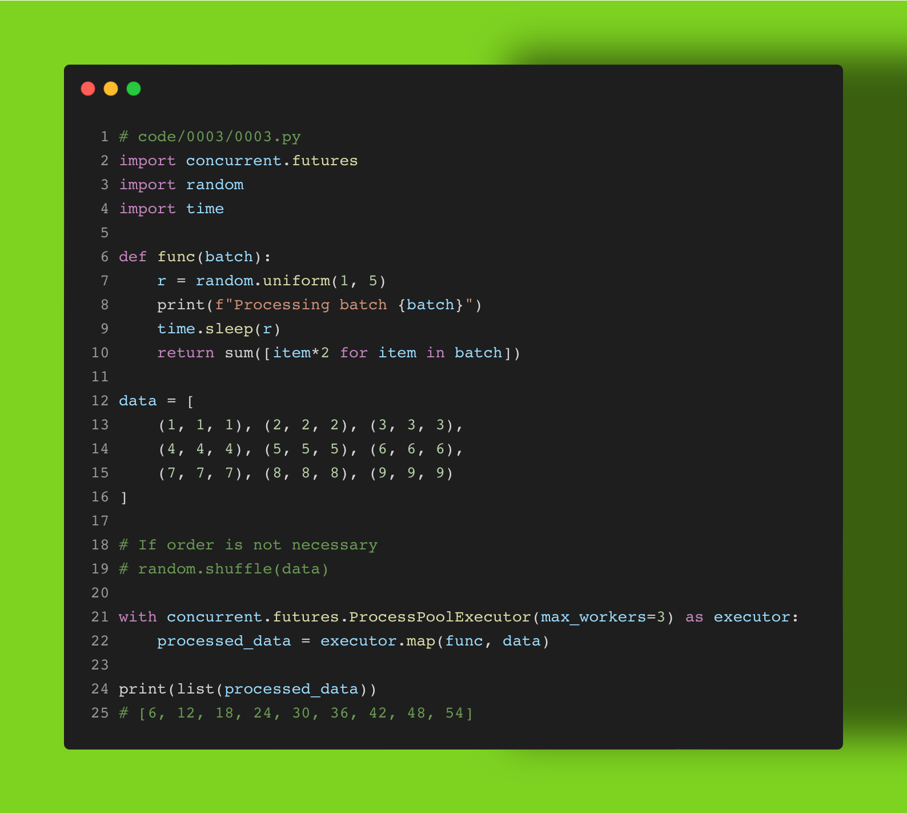

Nothing optimizes #dataengineering in #python as much as parallel processing. 

In this example, we're using a collection of data sets (batches). We can process them in a uniform way, such as taking the sum of their values doubled. In just a few lines of code, you can generalize your data processing in a parallel fashion.

Do you know the difference between ProcessPoolExecutor and ThreadPoolExecutor, and when to apply each? What would an asyncio alternative look like? Do you prefer working with the Threads module directly? 

