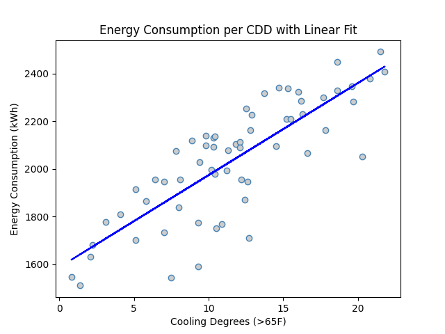

Now unless you want to wrap all your scipy, or tensorflow, etc. into #Spark wrappers, you will need to pick up the SparkML API to scale your machine learning to big datasets. It is not like PyTorch or Tensorflow, unfortunately. It does have a reason to its design, and can definitely support #python MLOps workflows. I will try to demonstrate.

The SparkML libraries is nicely broken up into relevant components for feature engineering and various modeling options. Here we import the most common vector assembler (combines your feature sets into a single input vector) and the LinearRegression modeler. For this simple regression, this isn't needed, but you can build ML pipelines defined by a series of assemblers to engineer your final feature vector. Each one transforms your input dataframe and is fed into the next. We do a single transform on the dataset and then define and fit our model using that features dataframe.

From there, we can fit the model to our features set to get fitted values for our visualization. We redo the scatter plot, with less adjustments this time, and plot the predictions with a standout line.

Have you used SparkML before? What has your experience been like? Have you tried designing your own custom routines? Have you used PyTorch or Tensorflow on large distributed sets? How does it compare?

## Output

