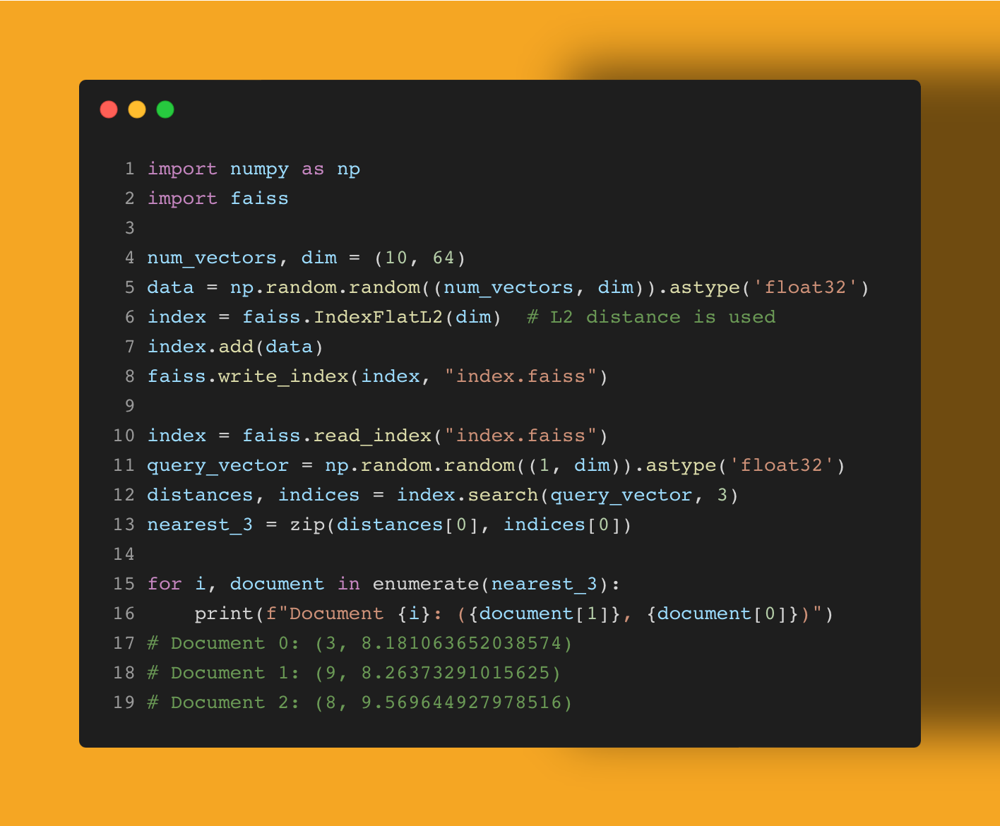

Vector databases are the hot topic lately, as they can provide the storage and execution engine for various advanced ML/AI methods. I'll admit, it's a new area for me. But I took a stab at getting started!

This snippet shows how easy it is to use the Facebook AI Similarity Search (FAISS) index library. Real data to come, but for now it's just random noise. Create an index of certain dimensions, make another random one and find the nearest 3 in the index. 

How might you use such a tool? Have you used the faiss library? What vector databases have you tried?

