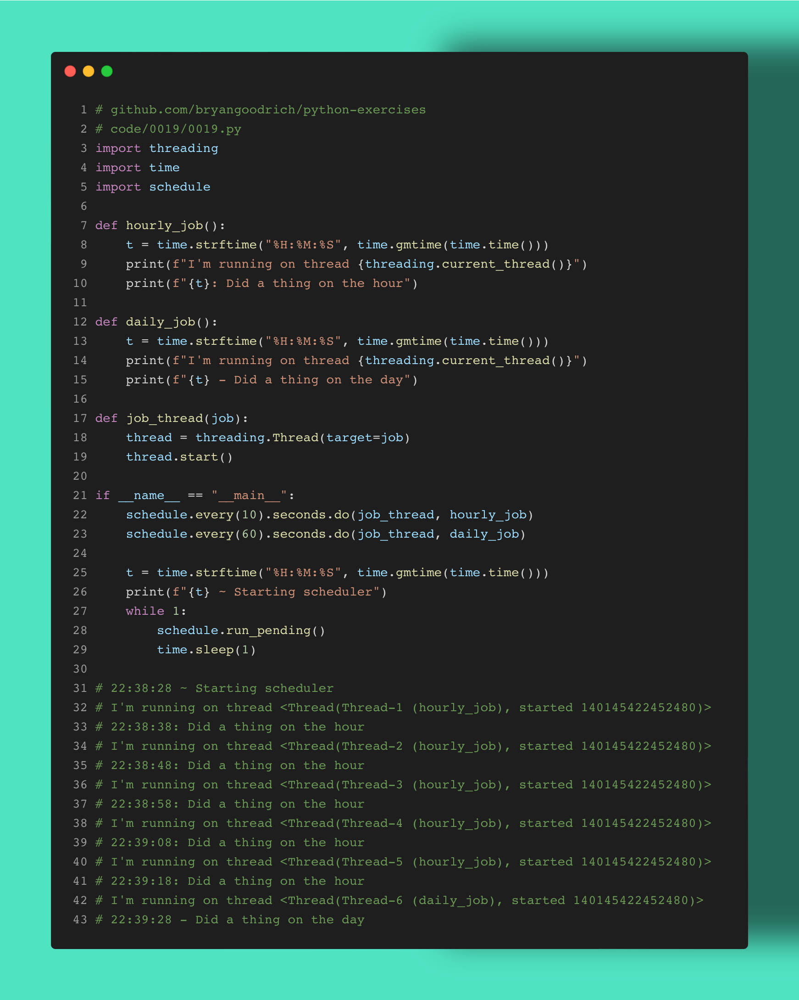

The Schedule #python library is a neat lighteweight scheduler you can use to build your own Airflow-like job orchestration.

This is far from a full-featured tool, as the docs admit, but looking at their examples, it can handle quite a lot of flows.

Have you heard of this library? How do you schedule your #dataengineering pipelines? What do you want to see next?

