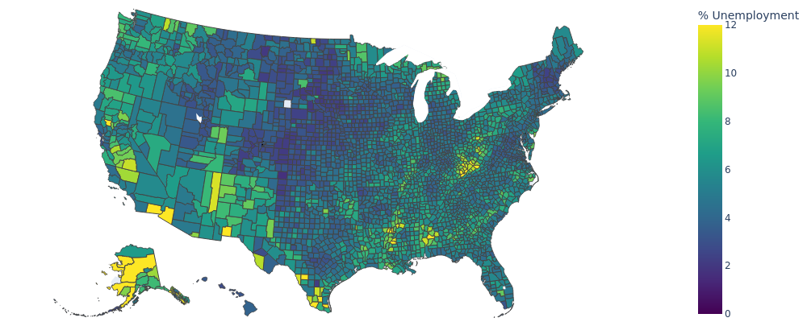

If you want to level up your #python analytics and #datascience skills, you need to know how to map geospatial data. Many innocuous data sets can be linked to points, lines, and polygons for visual display on a map. 

The Plotly library makes this easy and with the fig.show command, you can generate an interactive display in seconds! This example is lifted from their documentation, but it was fun to explore geopandas and matplotlib alternatives, as well. 

Have you done spatial analytics before? Do you want to see how to use geopandas and spatial projections? Let me know in the comments below!

# Output

