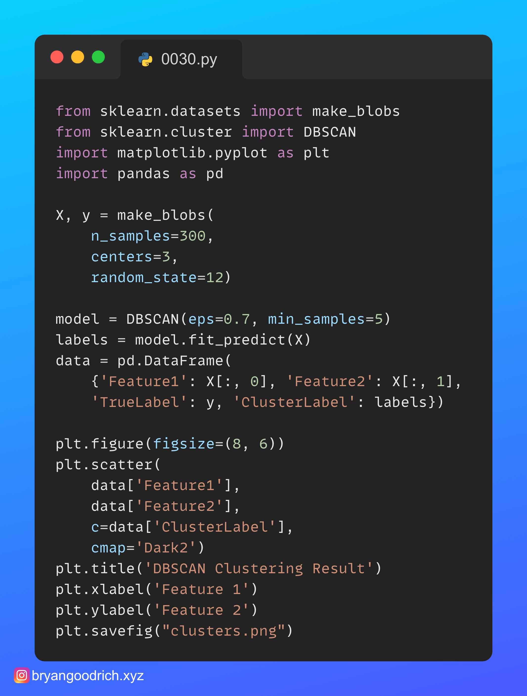
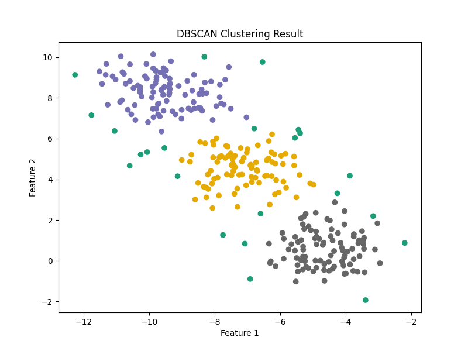

There are so many unsupervised (clustering) algorithms out there, it's a shame most data science programs I've seen only introduce you to K-Means and its variations. Let's look at how easy DBSCAN is!

With sklearn you can easily run it against a matrix of values. I put all the data together, so it's easy to plot. For this mock example, we can see where the data blends together and we get a mix of outliers and potential misclassifications. 

What other clustering algorithms do you use? Would you like to see hierarchical clustering? Let's talk in the chat!

#datanalytics #datascience #dataengineering #machinelearning #devops

------
🗣 If you like this post, follow me for daily #python tips, and hit that like button so the algorithms help others see it, too. For full code and data on this and earlier exercises, visit https://www.github.com/bryangoodrich/python-exercises
------

# Output

